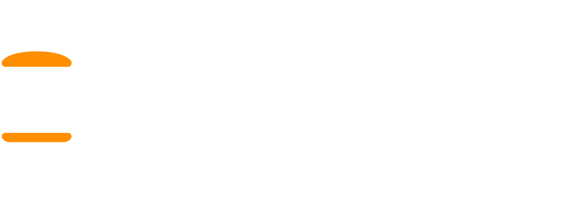

<div align="center">
    
    <h1>Blaze Burger</h1>
    <p>Next.js website for Blaze Burger at 208 Queens Quay West, Toronto ON</p>
</div>

## Getting Started

First, run the development server:

```bash
npm run dev
# or
yarn dev
# or
pnpm dev
# or
bun dev
```

Open [http://localhost:3000](http://localhost:3000) with your browser to see the result.
